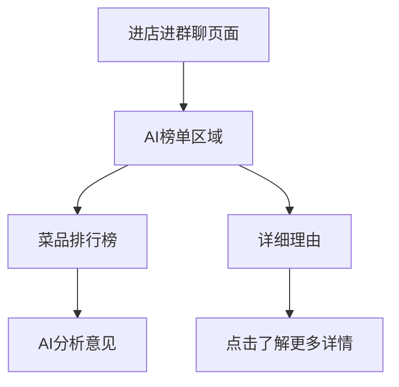
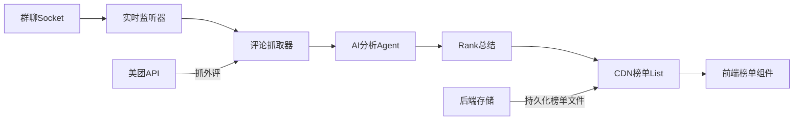
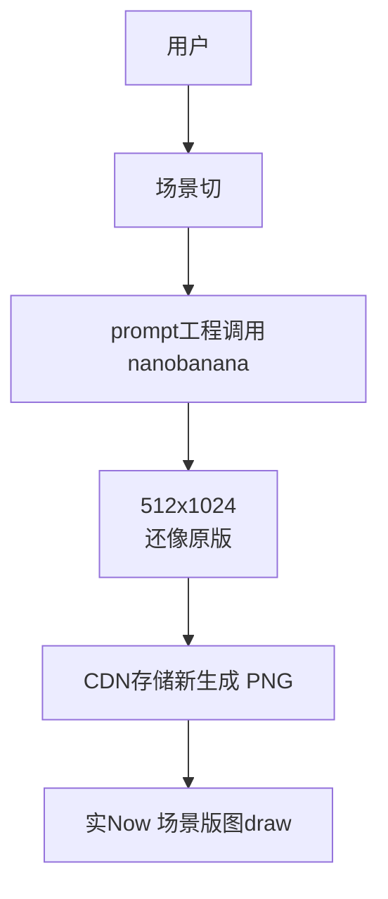
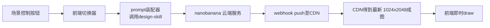
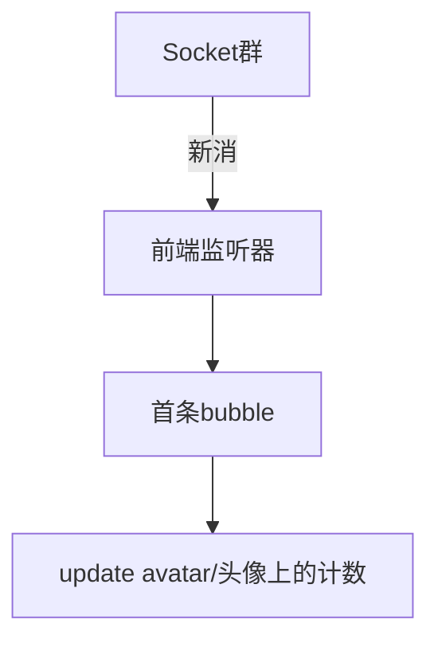
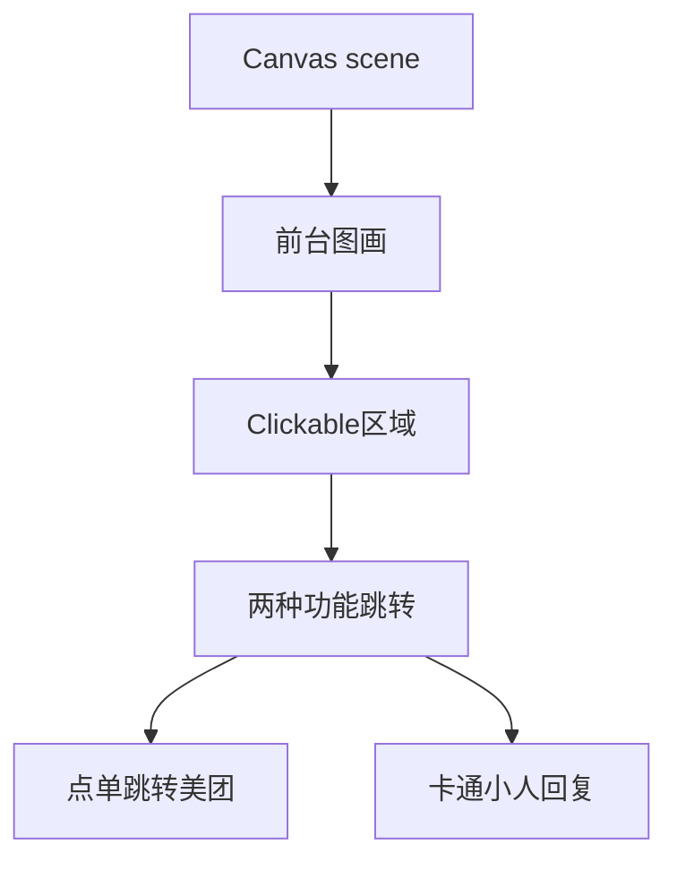

# 🎯 功能待完善设计规范

## 📝 文档版本信息
- **文档名称** FUTURE_FEATURES_DESIGN.md
- **版本** v3.0.0
- **更新时间**: 2026-06-01
- **状态**: Draft • Feature Design

---

## ××
# 1. 🧾 店内产品榜单+推荐理由 \(#TOP-PRODUCTS\)

### 1.1 需求说明

#### 🎯 核心目标

提升顾客快速决策菜品效率, 通过AI整合群讨论和外部评,炒热榜单

#### 🔍 使用场景



#### 📊 需求功能矩阵

| 功能 | 描述 |
|------|------|
| 1 榜单entar | 群聊天记录→TOP推荐 |
| 2 内部讨论外采 | 美团评论同步引入 |
| 3 实时动态榜单 | 对话更→更新榜 | |
| 4 可点击展开 | 支持详情文案 |

### 1.2 技术实se实现Design

#### 🏗 系统架oser



#### ⚙ LLMpromp模板

```TXT
任务:根据店内最新群聊对话总结TOP产品榜单

context
群聊对话内容:
{"chatHistory": ["...10分钟内对话..."],
外部评list:
["美团评论1...", "美团评论2..."]

规则:
- find TOP3招牌产品
- 查找5条顾客主要positive”的reason理由
- 关于主要槽点(如果有的话)
- 榜单123输出
---
产品1: 明星菜
理由:
- "好吃,再次消费decision最高"
- "口感好,味道佳" "必点"
- "推荐,适合双人"

产品2: ...
理由:
- ...

注:如需长content可 list 10+ reason,短只List Top5
```

#### 🔌 美团评论外部补充

```js
// (美团内嵌环境可接入)
async function fetchMeituanComments(shopId) {
    const mtComments = await wx.miniProgram.invokeApi({
        api: 'meituan.getReviews',
        shopId: shopId 
    });
    return mtComments;
}
```

#### 🖥 UI component结构

``` HTML
<!-- app.json 页面配置 -->
{
    "navigationBarTitleText": "店铺群聊",
    "component": "true"
}
```

```wxml
<!-- detail-页面调用 -->
<view class="ai-ranking-panel">
    <text class="panel-title">🏆 AI当家产品榜</text>
    
    <view class="ranking-list">
        <block wx:for="{{rankingList}}" wx:key="id">
            <view class="ranking-item">
                <text class="rank-number">NO.{{index+1}}</text>
                <image class="product-img" src="{{item.image}}"></image>
                <text class="product-name">{{item.name}}</text>
                
                <view class="reasons-collaspe"
                      bind:tap="toggleReason"
                      data-index="{{index}}"
                      wx:if="{{!item.expanded}}">
                    <text class="hint-text">点击查看 推荐理由</text>
                </view>
                
                <view class="reasons-list"
                      wx:if="{{item.expanded}}">
                    <block wx:for="{{item.reasons}}" wx:key="reason">
                        <text class="reason-item">• {{reason}}</text>
                    </block>
                </view>
            </view>
        </block>
    </view>
</view>
```

#### 🤖 Agent工作流

```sequenceDiagram
店Main-Agent->>评论监听器: 群聊流监听
评论监听器->>外部抓取: 定时抓取美团评
外部抓取->>DataStore:Summary缓存
DataStore->>DailyAgent:定时轮询trigger
DailyAgent->>LLM分析:请求榜单分析
LLM分析->>CDN FILES:推送榜单JSON
CDN FILES->>前端components: fetch榜单静态
```

---

##  2. 🎨 AI图片生成能力升级+多场景design能力\(#AI-SCENES\)

### 2.1 需求说明

#### 🎯 核心目标

传统Sprites素材切换了成场景端对端AI生成，支持bar/cafe/restaurant/等泛化生成任意场景

#### 🔍 设计说明



#### 📊 需求功能矩阵

| 功能 | 描述 |
|------|------|
| 1 模型升梭nano | 从Clipdrop换成nanobanana |
| 2 scene slic | 支持换bar/cafe/restaurant/ext |
| 2 prompt进阶 | design-skill schema |
| 3 Cache资产 | 产出成 PNG CDN缓存 |

### 2.2 技术实现Design

#### 🏗 新系统架nanobanana+design



#### ⚙ Design Schema

**DI设计system**

design-skill为假定已在项目能用调用
设计以下 JSON Schema

```json
{
  "$schema": "http://json-schema.org/draft-07/schema#",
  "type": "object",
  "design": {
    "sceneType": "bar|restaurant| |casual",
    "style": "stardew|minecraft|8bit|modern-pixce",
    "size": "512x256|1024x512|2048x1024",
    "prompt_params": {
       "atmosphere": "cozy|warm|party|relaxed",
       "palette": "orange-red|blue-purple|earth| ",
       "details": "table|chairs|decoration|light-"
    },
    "business": {
      "shop_spec": "烧烤店?面馆?日料?"
    }
  }
}
```

#### 🖼 Nanobanana/其他选型参数

| 工具 | 价格 | ork 率 |  建议 |
|--------|--------|--------|-------|
| nanobanana | ¥300/月 | 512 30S | ⭐⭐⭐⭐ |
| Bing Image | 免费 | 60 seconds| ⭐⭐⭐ |
| Google SDXL | ¥400/月 | 600ms| ⭐⭐⭐⭐⭐ |

#### 🚧 Prompt 操作Engineering

```python
sys.meta_prompt = """
设计优质像素游戏场景图
<技能清单>
- 像素图标16px/32px alignment
- 场景层次分前后layer
- 善用家具示意表达氛围
- 色调:暖色温馨
- 风格:柔和border
- 主题:bar interior rlaxed

场景规格:
- width: 1024px
- height: 512px
-background: #2C1810

输出格式:
只需输出最终的prompt即可,不要多余任何输出
"""
```

#### 🖥 动态切场景control

```wxml
<!-- 顶部场景切换控制 -->
<view class="scene-switcher">
    <button class="switcher-btn" data-type="day" bindtap="switchScene">day</button>
    <button class="switcher-btn" data-type="night" bindtap="switchScene">night</button>
    <button class="switcher-btn" data-type="cafe" bindtap="switchScene">cafe</button>
</view>
```

```js
// SceneUtils.js
switchScene(e) {
    const sceneType = e.currentTarget.dataset.type;
    this.data.currentScene = sceneType;

    // design + LLM call
    const generated_prompt = useDesignSkillCalls({
        sceneType: sceneType,
        atmosphere: "cozy",
        detail: "bistro"
    });

    // call nanobanana endpoint
    this.callNanobanana(generated_prompt);
}
```

---

##  3. 💬 用餐顾客头上显示avatar内容与统计 \(#CHAT-AVATAR\)

### 3.1 需求说明

#### 🎯 目标
顾客Canvas上方显示头像,对话气泡总条数记

#### 🔍 实时流设计



### 3.2 技术实se实现Design

#### 🏗 数据结构

```JSON
{
    "npcs": [
        {
            "id": "npc_001",
            "avatar": "images/npc/avatar-boy-1.png",
            "name": "顾客A",
            "position": [120, 300],
            "currentBubbleMsg": "这家的牛肉面太好",
            "bubbleMsgTimestamp": 1600000010000,
            "total_msg_count": 18,
        }
    ]
}
```

#### 🖥 Canvas-npc bubbles overlay

```WXML
<!-- Canvas之上覆盖头像气泡 -->
<cover-view class="npc-layers">
    <block wx:for="{{npcs}}" wx:key="id">
        <cover-view class="npc-avatar-group"
                   style="left: {{item.position[0]}}px;top: {{item.position[1]}}px;">
            
            <!-- 头像 -->
            <image class="npc-avatar" src="{{item.avatar}}"></image>

            <!-- 消息条数badge -->
            <cover-view class="msg-count-badge">
                <text class="msg-count-num">{{item.total_msg_count}}</text>
            </cover-view>

            <!-- 对话bubble -->
            <cover-view class="msg-bubble"
                       wx:if="{{item.currentBubbleMsg}}">
                <text class="bubble-text">{{item.currentBubbleMsg}}</text>
            </cover-view>
            
        </cover-view>
    </block>
</cover-view>
```

#### 📊 Avatar CSS design

```CSS
.npc-avatar-groups {
    position: absolute;
    z -index: 99;
}

.npc-avatar img {
    width: 64px;
    height: 64px;
    border-radius: 50%;
    border: 2px solid #fff;
}

.msg-count-badge {
    position: absolute;
    top: -6px;
    right: -6px;
    background: #ff4d4f;
    color: white;
    border-radius: 12px;
    padding:2px 8px;
    font-size: 12px;
    min-width: 18px;
}

.msg-bubble {
    position: absolute;
    top: -32px;
    left: 36px;
    background: rgba(0,0,0,0.8);
    color: white;
    padding: 6px 12px;
    border-radius: 8px;
    font-size: 14px;
    max-width: 168px;
    animation: bubblePop 0.3s ease-in-out;
}

```

#### 🤖 Avatar Messages黏贴flow

```js
// 实时群新socket 处理
onNewGroupMessage(message) {
    const npc = findNPCbyUserId(message.userId);
    if (npc) {
        // 更新当前聊天气泡 最后一条
        npc.currentBubbleMsg = message.content;
        
        // 更新计数 总条数++
        npc.total_msg_count += 1;
        
        // 设定消失 5秒钟
        setTimeout(() => {
            npc.currentBubbleMsg = '';
        }, 5000);
    }
}
```

---

##  4. 🪑 前台Cartoon前台卡通+点单功能 \(#FRONT-DESK\)

### 4.1 需求说明

#### 🎯 target

Canvas内bar前台卡通台 绘入,卡通小人+桌。支持:1) 前端美团点单 2) 点击食后卡通语响应

#### 🔍 两层实现设计



### 4.2 技术实现Design

#### 🏗 前端资assets目录

假定前台素材已有:
`images/bar-frontdesk.png`
`images/bar-waiter-cartoon.png`

#### ⚙ Clickable overlay -areahot区域

```WXML
<!-- Canvas之上前台cartoon为一体的Hot area -->
<cover-view class="frontdesk-interactions"
           style="left: 160px;top: 120px;width: 200px; height: 80px;">
    <!-- 分两个可点击区域 -->
    <!-- table区域 -->
    <cover-view class="frontdesk-table"
               bindtap="onTableClick"
               style="width: 120px; height: 40px;">
        <text class="area-hint">点单</text>
    </cover-view>

    <!-- 卡通小人区域 -->
    <cover-view class="frontdesk-waiter"
               bindtap="onWaiterClick"
               style="width: 80px; height: 60px;">
        <image src="images/bar-waiter-cartoon.png"
               class="waiter-sprite"
               mode="widthFix"></image>
        <text class="area-hint">对话</text>
    </cover-view>
</cover-view>
```

#### ➡️ 触发事件设计

```js
// detail.js 前台事件处理

/**
 * table 点击点单跳转美团
 */
async onTableClick() {
    wx.navigateToMiniProgram({
        appId: '美团官方小程序appid',
        path: `pages/order/index?shopId=${this.data.storeId}`,
        extraData: {
            source: 'foodie-social',
            scene: 'canvas-interaction'
        }
    });
}

/**
 * waiter 点击卡通人对话
 */
async onWaiterClick() {
    const presetReplies = getPresetReplies(this.data.storeId);
    const randomReply = presetReplies[Math.floor(Math.random() * presetReplies.length)];

    // 向canvas叠加卡通bubble
    this.showWaiterBubble(randomReply);
}

/**
 * 显示前台小人聊天气泡
 */
showWaiterBubble(replyText) {
    this.setData({
        waiterBubble: {
            text: replyText,
            show: true,
            timestamp: Date.now()
        }
    });

    // 5秒消失
    setTimeout(() => {
        this.setData({
            waiterBubble: { show: false }
        });
    }, 5000);
}
```

#### 📣 Preset卡通人回复Template

##### 方案A：商家自定义设计
```JSON
{
    "shop_id": "xxx",
    "PresetResponseList": [
        "我家的麻辣香锅是招牌，大家可以试试！",
        "牛肉面是本店特色，老顾客都爱点",
        "今天有新品小龙虾，第二份半价哦",
        "想要辣的还是不辣的？我推荐中等辣度",
        "感谢光临，欢迎下次再来"
    ]
}
```

##### 方案B：LLM总结商家店铺特色信息

```TXT
商家店铺信息总结任务
Info:
店铺名称: 川味小炒
主营产品: 川菜，麻辣风格
老客评价: "味道很不错，还会再来"
"环境好，性价比好"

要求:
输出5条卡通前台对话预设
每条应在20字左右
结合店特色写
语气亲和例如"可以试试"
```

##### ☑️ LLM总结回复Prompt模版

```TXT
商家信息:
name: "${shopName}"
recommendation: "${productList}"
reviews:
["评价1..."]
["评价2..."]

卡通前台回复任务要求:

依据商家信息，总结5条卡通前台对话
每条8-20char之间 
表达:亲和友好 
含:招牌菜推荐

输出格式仅:
1. xxx
2. xxx
3. xxx
4. xxx
5. xxx
```

#### 🖼 前台卡通eque bubble

```WXML
<!-- waiter bubble overlay -->
<cover-view class="waiter-speech-bubble"
           wx:if="{{waiterBubble.show}}"
           style="left: 240px; top: 100px;">
    <text class="speech-text">{{waiterBubble.text}}</text>
    <cover-view class="bubble-tail"></cover-view>
</cover-view>
```

```CSS
.waiter-speech-bubble {
    position: absolute;
    background: rgba(255, 255, 255, 0.95);
    color: #333;
    padding: 12px 16px;
    border-radius: 12px;
    font-size: 14px;
    box-shadow: 0 4px 12px rgba(0,0,0,0.15);
    animation: waiterPop 0.4s ease-in;
    max-width: 180px;
    z-index: 100;
}

.bubble-tail {
    position: absolute;
    bottom: -8px;
    left: 20px;
    width: 16px;
    height: 16px;
    background: rgba(255,255,255,0.95);
    transform: rotate(45deg);
}

@keyframes waiterPop {
    0% { transform: scale(0.5); opacity: 0; }
    100% { transform: scale(1); opacity: 1; }
}

```

#### 🎯 美团小程序点单小程序跳转方式

```js
//美团不过 public id,采用openmini
wx.navigateToMiniProgram({
    appId: '美团公开id',
    path: `pages/order/index?shopId=${shopId}`,
    extraData: { source: 'in-canvas' }
});
```

---

## 📋 Overall 整体实现Roadmap

### Phase 1:产品榜\(#TOP-PRODUCTS\)
-群聊监听→AI榜单
-榜单组件
-前端榜单展示

### Phase 2:AI 换nano升级\(#AI-SCENES\)
-nano/adgen propmt设计
-前端切换功能
-场景CDN Cache

### Phase 3:顾客Avatar\(#CHAT-AVATAR\)
-前端cover-view实现
-socket监听avatar上计数
-气泡UI  detail

### Phase 4:卡通前台\(#FRONT-DESK\)
-前台素材增减
-hot区click事件
-点单功能+美团跳转
-卡通回复

---