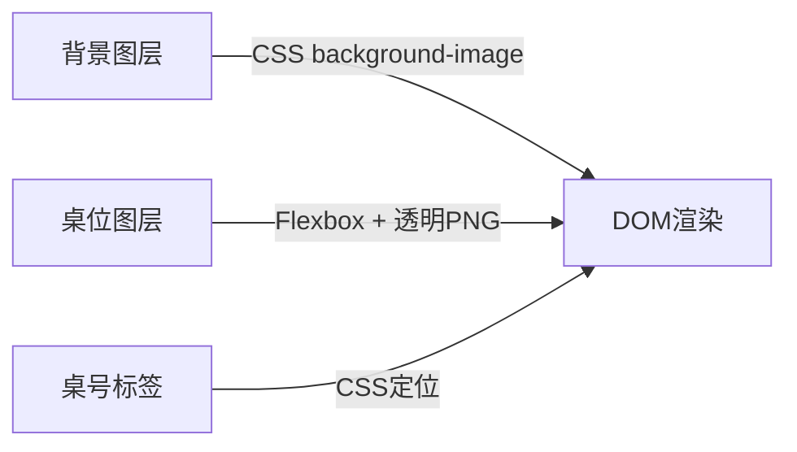
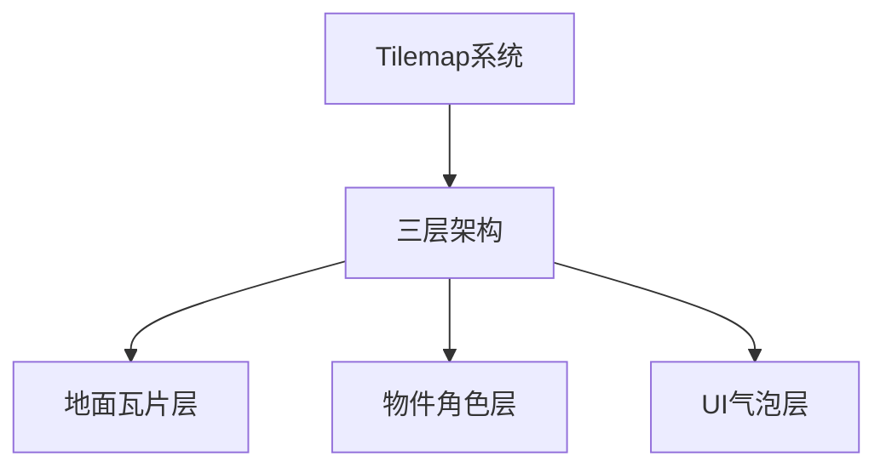

# 美食社交小程序 - 技术方案

## 1. 系统架构设计

### 1.1 整体架构
```
┌─────────────────────────────────────────────────────────────────┐
│                        客户端层                                │
│  ┌─────────────────┐  ┌─────────────────┐  ┌─────────────────┐  │
│  │   微信小程序     │  │  管理后台       │  │  第三方应用     │  │
│  └─────────────────┘  └─────────────────┘  └─────────────────┘  │
└─────────────────────────────────────────────────────────────────┘
                              │
                              ▼
┌─────────────────────────────────────────────────────────────────┐
│                        API网关层                                │
│  ┌─────────────────────────────────────────────────────────────┐  │
│  │  ┌─────────────────┐  ┌─────────────────┐  ┌─────────────────┐  │  │
│  │  │   身份认证      │  │   流量控制      │  │   安全防护      │  │  │
│  │  └─────────────────┘  └─────────────────┘  └─────────────────┘  │  │
│  └─────────────────────────────────────────────────────────────┘  │
└─────────────────────────────────────────────────────────────────┘
                              │
                              ▼
┌─────────────────────────────────────────────────────────────────┐
│                        业务服务层                                │
│ ┌─────────────────┐ ┌─────────────────┐ ┌─────────────────┐   │
│ │   用户服务       │ │   聊天服务       │ │   漂流瓶服务     │   │
│ └─────────────────┘ └─────────────────┘ └─────────────────┘   │
│ ┌─────────────────┐ ┌─────────────────┐ ┌─────────────────┐   │
│ │   店铺服务       │ │   AI生成服务     │ │   榜单服务       │   │
│ └─────────────────┘ └─────────────────┘ └─────────────────┘   │
└─────────────────────────────────────────────────────────────────┘
                              │
                              ▼
┌─────────────────────────────────────────────────────────────────┐
│                        数据层                                    │
│  ┌─────────────────┐  ┌─────────────────┐  ┌─────────────────┐  │
│  │    MongoDB      │  │     Redis       │  │    文件存储     │  │
│  └─────────────────┘  └─────────────────┘  └─────────────────┘  │
└─────────────────────────────────────────────────────────────────┘
```

### 1.2 技术栈选择

#### 后端技术栈
- **主语言**：Node.js (v18+)
- **框架**：Express.js
- **实时通信**：Socket.io
- **数据库**：MongoDB (主数据库), Redis (缓存和会话)
- **搜索引擎**：Elasticsearch (可选，用于高级搜索)
- **文件存储**：腾讯云COS / 阿里云OSS
- **任务调度**：node-cron
- **日志系统**：Winston

#### 前端技术栈
- **小程序框架**：原生微信小程序 (WXML/WXSS/JS)
- **渲染方案**：DOM+Flexbox + 透明PNG素材叠加 (v5.1)
- **核心组件**：restaurant-canvas (背景图+Combo桌位叠加)
- **实时更新**：WebSocket / Socket.io-client
- **UI组件库**：Vant Weapp
- **图表库**：ECharts for WeChat
- **状态管理**：原生小程序data绑定 + 事件通信
- **Canvas备用方案**：高性能Canvas 2D渲染管线（参考场景渲染方案）

#### AI服务技术栈
- **AI框架**：Python 3.11 + FastAPI
- **机器学习**：TensorFlow/PyTorch
- **图像处理**：OpenCV, Pillow
- **NLP**：Transformers

## 2. 数据库设计

### 2.1 MongoDB 数据模型

#### 用户集合 (users)
```javascript
{
  _id: ObjectId,
  user_id: String,        // 微信openid
  nickname: String,       // 昵称
  avatar: String,         // 头像URL
  gender: Number,         // 性别 0-未知 1-男 2-女
  age: Number,            // 年龄
  level: Number,          // 用户等级
  created_at: Date,
  updated_at: Date,
  last_login: Date,
  preferences: {          // 用户偏好
    notification: Boolean,
    anonymous: Boolean
  },
  statistics: {           // 统计信息
    groups_joined: Number,
    bottles_sent: Number,
    bottles_received: Number,
    reviews_written: Number
  }
}
```

#### 店铺集合 (stores)
```javascript
{
  _id: ObjectId,
  store_id: String,       // 美团店铺ID
  name: String,           // 店铺名称
  address: String,        // 店铺地址
  location: {             // 地理位置
    type: "Point",
    coordinates: [lng, lat]
  },
  wifi_info: {            // WiFi信息
    ssid: String,
    password: String,
    bssid: String
  },
  table_count: Number,    // 餐桌数量
  image_url: String,      // 原始店铺图片
  ai_image_url: String,   // AI生成图片
  status: Number,         // 状态 0-禁用 1-启用
  created_at: Date,
  updated_at: Date,
  settings: {
    max_group_duration: Number,  // 最大群聊时长(小时)
    allow_anonymous: Boolean,   // 允许匿名
    require_review: Boolean     // 需要审核
  }
}
```

#### 群聊集合 (chat_groups)
```javascript
{
  _id: ObjectId,
  group_id: String,
  store_id: String,       // 关联店铺
  name: String,           // 群聊名称
  status: Number,         // 状态 0-禁用 1-活跃 2-已解散
  created_at: Date,
  updated_at: Date,
  settings: {
    max_members: Number,  // 最大成员数
    auto_leave_time: Number // 自动退群时间(小时)
  },
  statistics: {
    total_messages: Number,
    active_members: Number,
    peak_members: Number
  }
}
```

#### 群成员集合 (group_members)
```javascript
{
  _id: ObjectId,
  group_id: String,
  user_id: String,
  store_id: String,
  table_number: Number,   // 桌号
  join_time: Date,
  leave_time: Date,
  last_active: Date,
  status: Number,         // 0-离线 1-在线 2-已离开
  session_data: {         // 会话数据
    is_anonymous: Boolean,
    display_name: String,
    trigger_conditions: {
      location_verified: Boolean,
      wifi_connected: Boolean,
      order_verified: Boolean
    }
  }
}
```

#### 消息集合 (messages)
```javascript
{
  _id: ObjectId,
  message_id: String,
  group_id: String,
  store_id: String,
  sender_id: String,
  sender_name: String,    // 显示名称(桌号或匿名ID)
  message_type: String,   // text/image/voice/review
  content: String,        // 消息内容
  metadata: {             // 元数据
    timestamp: Date,
    edited: Boolean,
    deleted: Boolean,
    edited_at: Date
  },
  review_data: {          // 评价数据(如果是评价消息)
    dish_id: String,
    rating: Number,
    images: [String]
  },
  read_by: [String],      // 已读用户列表
  created_at: Date
}
```

#### 漂流瓶集合 (bottles)
```javascript
{
  _id: ObjectId,
  bottle_id: String,
  sender_id: String,
  store_id: String,
  content: String,        // 问题内容
  visibility: Number,     // 0-仅拾取者可见 1-全部可见
  status: Number,         // 0-待处理 1-已分配 2-已拾取 3-已回复 4-已过期
  created_at: Date,
  assigned_at: Date,
  picked_at: Date,
  responded_at: Date,
  expired_at: Date,
  picker_id: String,      // 拾取者ID
  responses: [{           // 回复列表
    user_id: String,
    content: String,
    timestamp: Date,
    is_sender: Boolean    // 是否是发起者
  }],
  metadata: {
    max_responses: Number,
    response_count: Number
  }
}
```

#### 菜品评价集合 (dish_reviews)
```javascript
{
  _id: ObjectId,
  review_id: String,
  user_id: String,
  store_id: String,
  dish_id: String,        // 菜品ID
  dish_name: String,      // 菜品名称
  rating: Number,         // 评分 1-5
  content: String,        // 评价内容
  images: [String],       // 图片URL数组
  tags: [String],         // 标签
  helpful_count: Number,  // 有用数
  created_at: Date,
  updated_at: Date,
  verified: Boolean,      // 是否已验证(满足触发条件)
  status: Number          // 0-待审核 1-已发布 2-已删除
}
```

#### 用户位置集合 (user_locations)
```javascript
{
  _id: ObjectId,
  user_id: String,
  store_id: String,
  location: {
    type: "Point",
    coordinates: [lng, lat]
  },
  accuracy: Number,       // 定位精度
  wifi_info: {            // WiFi信息
    ssid: String,
    bssid: String,
    signal_strength: Number
  },
  order_verified: Boolean, // 订单是否已核验
  entry_time: Date,       // 进店时间
  exit_time: Date,        // 离店时间
  is_inside: Boolean,     // 是否在店内
  updated_at: Date
}
```

### 2.2 场景渲染架构

#### 渲染管线设计
**v5.1 当前实现（推荐方案）**：


**Canvas 2D 参考架构（备用方案）**：


#### 核心组件规范

**restaurant-canvas 组件**：
- **文件位置**：frontend/components/restaurant-canvas/
- **属性传递**：sceneConfig（包含主题、桌位数据、背景等）
- **素材路径**：/images/restaurant/ 目录统一管理
- **交互事件**：tabletap事件向上传递

**渲染性能标准**：
- **帧率标准**：Canvas 2D 渲染维持 60fps（如适用）
- **内存控制**：iOS 低端机内存峰值 < 1GB
- **渲染管线**：DrawCall 控制在 10 以内
- **启动性能**：小程序冷启动时间 ≤ 3秒
- **场景加载**：餐厅场景渲染完成时间 ≤ 1.5秒

#### 素材规范

**背景素材**：
- 规格：750×320px JPG/PNG
- 分类：4张（白天×晴天/雨天 + 夜晚×晴天/雨天）
- 路径：/images/restaurant/bg-*.png

**Combo桌位素材**：
- 规格：90×90px 透明PNG
- 类型：11张（无人×1 + 单人×2 + 双人×1 + 三人×2 + 四人×1）
- 路径：/images/restaurant/combo-*.png
- 锚点：底边中心点对齐

#### 渲染算法

**Y-Sorting深度排序**（Canvas方案）：
```javascript
// 实现逻辑
function sortRendersByDepth(objects) {
    return objects.sort((a, b) => a.y - b.y);
}

// 渲染循环
sortedObjects.forEach(obj => {
    renderSprite(obj.sprite, obj.x, obj.y);
});
```

**Flexbox布局计算**（DOM方案）：
```javascript
// 桌位网格计算
function calculateTableLayout(tables, containerWidth) {
    const tableSize = 90; // px
    const spacing = 10;   // px
    const perRow = Math.floor(containerWidth / (tableSize + spacing));
    
    return tables.map((table, index) => ({
        ...table,
        x: (index % perRow) * (tableSize + spacing),
        y: Math.floor(index / perRow) * (tableSize + spacing)
    }));
}
```

#### 环境状态系统

**色彩映射表**：
| 状态 | 滤镜类型 | RGBA调整 | 粒子特效 |
|------|---------|----------|-------- |
| 白晴 | 原色 | 无 | 无 |
| 白雨 | 冷蓝 | +20B/-10R | 60°雨丝 |
| 黑晴 | 蓝紫暗调 | -30亮度 | 光晕 |
| 黑雨 | 极暗蓝紫 | -50亮度 | 雨丝+光晕 |

**实现接口**：
```javascript
class EnvironmentRenderer {
     applyColorTint(state) {
         switch(state) {
             case 'sunny_day': return null;
             case 'rainy_day': return 'rgba(240, 240, 255, 0.3)';
             // ... 其他状态
         }
     }
 }
 ```

#### NPC对话系统架构

**数据结构设计**：
```typescript
interface NPCDialogue {
  total_chats: number;           // 长期计数器
  speech_history: string[];     // 历史记录数组
  bubble_timer: number;         // 气泡倒计时(120秒)
  bubble_text: string;          // 当前显示文本
  bubble_active: boolean;       // 气泡显示状态
}
```

**渲染管线实现**：

**即时气泡渲染**：
```javascript
class DialogueBubbleRenderer {
    // 9-Slice气泡渲染
    renderBubble(text, x, y) {
        const bubbleOffsetY = -60; // 头顶偏移
        const bubbleRect = this.calculateBubbleSize(text);
        
        // 渲染9-Slice边框
        this.renderNineSlice(
            BUBBLE_TEXTURE, 
            x - bubbleRect.width/2,
            y + bubbleOffsetY,
            bubbleRect.width,
            bubbleRect.height
        );
        
        // 渲染文本
        this.renderText(
            text,
            x - bubbleRect.textWidth/2,
            y + bubbleOffsetY + 10
        );
    }
    
    // 倒计时更新
    update(deltaTime) {
        if (this.data.bubble_active) {
            this.data.bubble_timer -= deltaTime;
            if (this.data.bubble_timer <= 0) {
                this.data.bubble_active = false;
            }
        }
    }
}
```

**数字标签系统**：
```javascript
class SpeechCounterRenderer {
    renderCounter(count, npcX, npcY) {
        // 计数器位置（独立于气泡，更高优先级）
        const counterY = npcY - 80;
        
        // 像素框背景 + 阿拉伯数字
        this.renderPixelBox(
            npcX - 12, counterY, 24, 16
        );
        this.renderText(
            count.toString(),
            npcX - 6, counterY + 3
        );
    }
}
```

**历史面板交互**：
```javascript
class HistoryPanelManager {
    // 手势劫持检测
    handleClick(clickX, clickY, npc) {
        if (this.isCounterHit(clickX, clickY, npc)) {
            // 阻断底层交互
            event.stopPropagation();
            this.showHistoryPanel(npc);
        }
    }
    
    // 历史面板渲染
    showHistoryPanel(npc) {
        const panel = new ScrollView({
            title: `${npc.tableNumber}号桌历史对话`,
            items: npc.speech_history.map(message => ({
                timestamp: message.time,
                content: message.text
            }))
        });
        panel.show();
    }
}
```

**实时消息处理流程**：
```javascript
class MessageProcessor {
    processNewMessage(npcId, message) {
        const npc = this.npcs[npcId];
        
        // 更新数据结构
        npc.total_chats++;
        npc.speech_history.push({
            text: message,
            time: new Date().toLocaleTimeString()
        });
        
        // 激活气泡
        npc.bubble_text = message;
        npc.bubble_active = true;
        npc.bubble_timer = 120; // 重置120秒计时器
        
        // 触发渲染更新
        this.renderer.update();
    }
}
```
```

### 2.3 Redis 缓存设计

#### 用户会话缓存
```
Key: session:{session_id}
Value: {user_id, login_time, last_active}
TTL: 24小时
```

#### 群聊在线用户
```
Key: group:{group_id}:members
Value: Set<user_id>
TTL: 无固定过期时间，根据用户活动更新
```

#### 用户位置缓存
```
Key: location:{user_id}:{store_id}
Value: {lng, lat, accuracy, is_inside, updated_at}
TTL: 5分钟
```

#### 漂流瓶池
```
Key: bottle:pool:{store_id}
Value: List<bottle_id>
TTL: 无固定过期时间
```

#### 实时消息队列
```
Key: message:queue:{group_id}
Value: List<message_id>
TTL: 24小时
```

## 3. API接口设计

### 3.1 用户相关接口

#### 用户认证
```
POST /api/v1/auth/login
Request: { code: "微信登录code" }
Response: { token: "JWT token", user: UserInfo }
```

```
POST /api/v1/auth/refresh
Request: { refresh_token: "刷新token" }
Response: { token: "新的JWT token" }
```

#### 用户信息
```
GET /api/v1/user/profile
Response: UserProfile
```

```
PUT /api/v1/user/profile
Request: { nickname, avatar, preferences }
Response: { success: true }
```

### 3.2 店铺相关接口

#### 店铺信息
```
GET /api/v1/store/{store_id}
Response: StoreInfo
```

```
GET /api/v1/store/search
Query: { keyword, location, radius }
Response: [StoreInfo]
```

#### 位置验证
```
POST /api/v1/store/location/verify
Request: { store_id, lng, lat, accuracy, wifi_info }
Response: { verified: boolean, is_inside: boolean }
```

### 3.3 群聊相关接口

#### 群聊管理
```
GET /api/v1/group/{store_id}/info
Response: GroupInfo
```

```
POST /api/v1/group/{store_id}/join
Request: { table_number, anonymous }
Response: { success: true, group_info }
```

```
POST /api/v1/group/{group_id}/leave
Response: { success: true }
```

#### 消息相关
```
GET /api/v1/group/{group_id}/messages
Query: { page, limit, before_time }
Response: [Message]
```

```
POST /api/v1/group/{group_id}/messages
Request: { content, message_type, review_data? }
Response: { message_id, timestamp }
```

### 3.4 漂流瓶相关接口

#### 漂流瓶管理
```
POST /api/v1/bottle/send
Request: { store_id, content, visibility }
Response: { bottle_id }
```

```
GET /api/v1/bottle/pool/{store_id}
Response: [BottleInfo]
```

```
POST /api/v1/bottle/{bottle_id}/pick
Response: { bottle_info }
```

```
POST /api/v1/bottle/{bottle_id}/respond
Request: { content }
Response: { response_id }
```

### 3.5 评价相关接口

#### 菜品评价
```
POST /api/v1/review/dish
Request: { store_id, dish_id, rating, content, images }
Response: { review_id }
```

```
GET /api/v1/store/{store_id}/reviews
Query: { dish_id?, page, limit, sort_by }
Response: [DishReview]
```

```
GET /api/v1/store/{store_id}/rankings
Response: [RankingItem]
```

## 4. WebSocket事件设计

### 4.1 连接事件
```javascript
// 连接建立
socket.on('connect', () => {
  console.log('WebSocket连接已建立');
});

// 断开连接
socket.on('disconnect', () => {
  console.log('WebSocket连接已断开');
});
```

### 4.2 群聊事件
```javascript
// 加入群聊
socket.emit('group:join', {
  group_id: 'group_id',
  table_number: 5
});

socket.on('group:joined', (data) => {
  console.log('成功加入群聊', data);
});

// 发送消息
socket.emit('message:send', {
  group_id: 'group_id',
  content: 'hello',
  message_type: 'text'
});

socket.on('message:new', (message) => {
  console.log('收到新消息', message);
});

// 用户状态
socket.on('user:online', (user_info) => {
  console.log('用户上线', user_info);
});

socket.on('user:offline', (user_id) => {
  console.log('用户下线', user_id);
});
```

### 4.3 漂流瓶事件
```javascript
// 新漂流瓶
socket.on('bottle:new', (bottle) => {
  console.log('收到新漂流瓶', bottle);
});

// 漂流瓶回复
socket.on('bottle:responded', (response) => {
  console.log('漂流瓶有新回复', response);
});
```

## 5. AI服务架构

### 5.1 图片生成服务

#### 输入参数处理
```python
class SceneGenerationRequest:
    store_id: str
    original_image: str  # 图片URL
    table_count: int
    current_weather: str
    is_night: bool
    chat_mood: str      # 从群聊分析出的氛围
    active_customers: int
```

#### 生成流程
1. **图片预处理**：下载原始店铺图片，调整尺寸和格式
2. **场景分析**：分析图片内容，提取场景特征
3. **风格转换**：转换为像素风格
4. **餐桌布局**：根据真实餐桌数量布局AI餐桌
5. **顾客生成**：添加匿名顾客NPC
6. **氛围渲染**：根据聊天内容调整场景氛围
7. **天气效果**：添加昼夜、天气效果
8. **输出保存**：保存生成的图片到CDN

### 5.2 内容分析服务

#### 聊天内容分析
- 情感分析：判断聊天氛围(积极/消极/中性)
- 关键词提取：提取菜品、环境等关键词
- 话题分类：美食推荐、环境评价、社交互动

#### 图片内容分析
- 物体检测：识别餐桌、装饰、区域
- 颜色分析：提取主色调和配色方案
- 风格识别：识别装修风格和文化特征

## 6. 安全设计

### 6.1 身份认证
- JWT Token认证
- 微信UnionID绑定
- 会话管理

### 6.2 数据保护
- 敏感数据加密
- 传输层加密(HTTPS/WSS)
- 数据库字段级加密

### 6.3 内容过滤
- 敏感词库过滤
- 图片内容审核
- 异常行为检测

### 6.4 访问控制
- API访问频率限制
- 用户权限验证
- 服务端参数校验

## 7. 性能优化

### 7.1 缓存策略
- 多级缓存架构
- 热点数据缓存
- 缓存预热机制

### 7.2 数据库优化
- 合理索引设计
- 读写分离
- 查询性能优化

### 7.3 实时通信优化
- 消息分片
- 连接池管理
- 断线重连机制

## 8. 监控和日志

### 8.1 监控指标
- 系统性能指标
- 业务指标监控
- 用户行为分析
- 异常告警

### 8.2 日志记录
- 访问日志
- 错误日志
- 业务日志
- 审计日志

## 9. 部署架构

### 9.1 容器化部署
- Docker容器
- Kubernetes编排
- 服务发现和负载均衡

### 9.2 云原生架构
- 弹性伸缩
- 多可用区部署
- CDN加速
- 数据库主从复制

本技术方案为美食社交小程序提供了完整的技术架构设计，确保了系统的可扩展性、安全性和高性能。